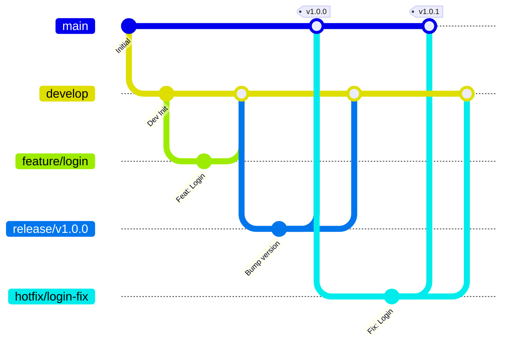

# Version Control Guidelines

이 문서는 프로젝트의 버전 관리 전략, 커밋 컨벤션, 그리고 협업 워크플로우를 정의합니다.

## 1. Branching Strategy (브랜치 전략)
Gitflow 전략을 기반으로 유연하게 운영합니다.

### 브랜치 종류
- **`main`**: 
  - 언제나 배포 가능한 상태(Production Ready)를 유지합니다.
  - `release` 브랜치나 `hotfix` 브랜치에서만 병합됩니다.
  - Tag를 통해 버전을 관리합니다 (예: `v1.0.0`).
- **`develop`**: 
  - 다음 배포를 위한 통합 개발 브랜치입니다.
  - 모든 `feature` 브랜치는 이곳으로 병합됩니다.
- **`feature/*`**: 
  - 새로운 기능 개발을 위한 브랜치입니다.
  - `develop`에서 분기하며, 개발 완료 후 `develop`으로 PR을 통해 병합합니다.
  - 명명 규칙: `feature/기능명` (예: `feature/user-auth`, `feature/payment-integration`)
- **`bugfix/*`**: 
  - 개발 중 발견된 버그 수정을 위한 브랜치입니다.
  - 명명 규칙: `bugfix/이슈명` (예: `bugfix/login-error`)
- **`hotfix/*`**: 
  - 운영 중인 `main` 버전에서 발생한 긴급 버그를 수정합니다.
  - `main`에서 분기하며, 수정 후 `main`과 `develop` 양쪽에 병합됩니다.
- **`release/*`**: 
  - 배포 준비를 위한 브랜치입니다. QA 및 최종 테스트를 진행합니다.
  - 명명 규칙: `release/vX.Y.Z`

## 2. Commit Convention (커밋 컨벤션)
Conventional Commits 규격을 따릅니다. 이는 커밋 메시지에 일관된 규칙을 적용하여, 사람이 읽기 쉽고 자동화 도구가 처리하기 쉬운 커밋 히스토리를 만드는 것을 목적으로 합니다.

### 기본 형식
커밋 메시지는 **Header**, **Body**, **Footer** 세 부분으로 구성됩니다.

```text
<type>(<scope>): <subject>

<body>

<footer>
```

#### 구성 요소 설명
1. **Header** (필수):
   - **Type**: 커밋의 성격을 나타냅니다. (예: `feat`, `fix`)
   - **Scope** (선택): 변경된 패키지나 모듈 등 범위를 지정합니다.
   - **Subject**: 제목은 50자 이내로, 명령문/현재 시제로 작성하며 마침표(.)를 찍지 않습니다.
2. **Body** (선택):
   - 헤더로 표현할 수 없는 상세한 내용을 작성합니다.
   - '무엇을', '왜' 변경했는지에 초점을 맞춥니다.
3. **Footer** (선택):
   - **BREAKING CHANGE**: 하위 호환성 문제가 발생하는 큰 변경사항이 있을 경우 명시합니다.
   - **Referencing Issues**: 해결한 이슈 번호를 적습니다. (예: `Fixes #123`)

### Type 종류
| Type | 설명 |
|------|------|
| `feat` | 새로운 기능 추가 |
| `fix` | 버그 수정 |
| `docs` | 문서 수정 (README, 가이드 등) |
| `style` | 코드 포맷팅, 세미콜론 누락 등 (로직 변경 없음) |
| `refactor` | 코드 리팩토링 (기능 변경 없음) |
| `test` | 테스트 코드 추가/수정 |
| `chore` | 빌드 업무 수정, 패키지 매니저 설정, 설정 파일 변경 등 |
| `perf` | 성능 개선 |

### 작성 예시
- `feat(auth): JWT 로그인 기능 구현`
- `fix(api): 사용자 조회 시 500 에러 수정`
- `docs(readme): 설치 가이드 업데이트`

## 3. Pull Request (PR) Process
모든 코드 변경사항은 Pull Request를 통해 검토 후 병합됩니다.

1. **PR 생성**:
   - 제목은 커밋 컨벤션과 동일하게 작성합니다.
   - 템플릿에 맞춰 변경 사항, 테스트 방법, 관련 이슈를 상세히 기재합니다.
2. **Code Review**:
   - 최소 1명 이상의 동료 리뷰어 승인(Approve)이 필요합니다.
   - 코멘트에 대해 적극적으로 소통하고 수정합니다.
3. **Merge**:
   - 리뷰가 완료되고 CI 테스트(있는 경우)가 통과하면 `develop` 브랜치로 병합(Squash and Merge 권장)합니다.

## 4. Versioning (버전 관리)
Semantic Versioning (SemVer) 원칙을 준수합니다. 소프트웨어의 버전 변경이 API 호환성에 미치는 영향을 명확히 하기 위해 `MAJOR.MINOR.PATCH` 형식을 사용합니다.

- **MAJOR**: 하위 호환되지 않는 API 변경 시
- **MINOR**: 하위 호환되는 기능 추가 시
- **PATCH**: 하위 호환되는 버그 수정 시

## 5. Issue Management (이슈 관리)
GitHub Issues를 통해 버그, 기능 요청, 개선 사항을 체계적으로 관리합니다.

### Issue Template
이슈 생성 시 제공되는 템플릿을 반드시 사용합니다.

- **Bug Report**: 버그 재현 방법, 예상 동작, 실제 동작, 스크린샷 등 포함.
- **Feature Request**: 제안하는 기능 설명, 목적, 기대 효과 등 포함.

### Labels
이슈의 성격을 명확히 하기 위해 라벨을 적극 활용합니다.

| Label | 설명 |
|-------|------|
| `bug` | 버그, 오류 수정이 필요한 경우 |
| `enhancement` | 새로운 기능 추가 또는 기존 기능 개선 |
| `documentation` | 문서 작성 또는 수정 |
| `question` | 질문이나 논의가 필요한 경우 |
| `wontfix` | 수정하지 않기로 결정된 이슈 |
| `duplicate` | 중복된 이슈 |
| `good first issue` | 신규 기여자가 해결하기 좋은 난이도의 이슈 |
| `help wanted` | 도움이 필요한 이슈 |

### Linking Issues
- PR 작성 시 관련 이슈를 연결하여 추적 가능하게 합니다.
- 예: `Fixes #123`, `Resolves #456` (PR 병합 시 이슈 자동 닫힘)

## 6. Workflow Diagram

